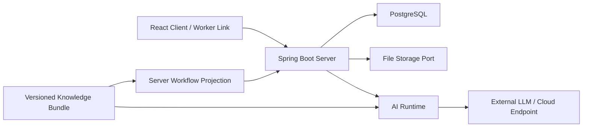

# FOWOCO Server

[](https://github.com/fowoco/server/actions/workflows/ci.yml)
[](https://github.com/fowoco/server/actions/workflows/database-docs.yml)

E-9 외국인근로자를 고용한 사업장의 체류·계약·서류·신고 업무를 안전한
HR Workflow로 운영하는 Spring Boot 백엔드입니다.

FOWOCO는 단순 번역 서비스가 아닙니다. 해야 할 일을 업무카드로 구조화하고,
필수정보·승인·증빙·다음 행동을 담당자가 놓치지 않도록 돕습니다.

> AI는 판단자가 아니라 보조자입니다. AI 결과는 인증, 사업장 권한, 상태 전이,
> HR 승인과 감사로그 안에서만 사용합니다.

## 가장 먼저 볼 문서

| 찾는 내용 | 바로가기 | 이 문서가 기준인 이유 |
| --- | --- | --- |
| 현재 구현된 API | [Swagger](https://fowoco.github.io/server/api/) · [OpenAPI JSON](https://fowoco.github.io/server/api/openapi.json) | `main` 코드에서 자동 생성되는 실제 API 계약 |
| DB 테이블·ERD | [Database 문서](https://fowoco.github.io/server/) | Flyway를 빈 PostgreSQL에 적용해 자동 생성한 구조 |
| 로컬 실행·인증·Workflow | [개발 가이드](docs/development-guide.md) | 처음 서버를 실행하고 기능 흐름을 이해하는 방법 |
| 패키지·모듈 경계 | [프로젝트 구조](docs/project-structure.md) | 코드를 어느 패키지에 구현해야 하는지 설명 |
| 중요한 설계 결정 | [ADR 목록](docs/adr/README.md) | 저장소 경계, API·보안, Task·AiRun, RLS 결정 원본 |
| Server ↔ AI 계약 | [AI Runtime 계약](docs/ai-runtime-contract.md) | Server가 AI에 보내고 받을 수 있는 값과 검증 기준 |
| 구현 계획·업무 상태 | [Server Roadmap](https://github.com/orgs/fowoco/projects/3) · [Issues](https://github.com/fowoco/server/issues) | 실제 담당자, 우선순위와 진행 상태 |
| 전체 설명·운영 가이드 | [Server Wiki](https://github.com/fowoco/server/wiki) | 초보자용 아키텍처·API·배포 설명 |

추가 링크:
[API 문서 사용법](docs/api-documentation.md) ·
[DB 문서 사용법](docs/database-documentation.md) ·
[RLS 적용 가이드](docs/database/postgresql-rls-rollout.md) ·
[Notion API 명세](https://app.notion.com/p/f250e15aa74e82b8872581be4d7c6c3c?v=f280e15aa74e82ce8d6e8848514d41c3&pvs=23) ·
[Figma](https://www.figma.com/design/eaOD8OXZOGq6vK4H9pGXNi/FOWOCO?node-id=143-2&t=YbytLHiwZ5m1IChO-1) ·
[Discussions](https://github.com/fowoco/server/discussions)

## Server가 담당하는 일

- 사업장 사용자 인증과 `ADMIN`·`HR`·`VIEWER` 권한
- `company_id`를 기준으로 한 사업장 데이터 격리
- 근로자 기본정보와 서류 메타데이터 관리
- 업무카드·체크리스트·상태 전이 관리
- HR 승인·반려·외부 제출·증빙·완료와 감사로그
- 만료되는 근로자 보안 링크
- AI Runtime 요청·응답 검증과 영속 실행 이력
- 실패해도 유실되지 않는 후속 이벤트 처리

Provider SDK, Prompt와 모델 라우팅은 Server에 구현하지 않습니다.

| 저장소 | 책임 |
| --- | --- |
| `server` | 인증·권한·Worker·Task·승인·감사·링크·영속 상태 |
| `ai` | Prompt, Agent Pipeline, 모델·Provider 호출 |
| `knowledge` | Intent·Slot·Workflow Catalog·공식 근거·평가 데이터 |
| `client` | HR·근로자 화면과 사용자 상호작용 |
| `infra` | 통합 배포 환경, 네트워크, Secret과 관측 인프라 |

상세 소유권과 금지 의존성은
[ADR-0001](docs/adr/0001-repository-and-module-boundaries.md)을 따릅니다.

## 현재 구현 기준

고정된 API 개수를 README에 적지 않습니다. API는 계속 변경되므로 현재 구현
여부는 [Swagger](https://fowoco.github.io/server/api/)와 자동화 테스트를
기준으로 확인합니다.

| 영역 | `main`에서 확인할 수 있는 내용 |
| --- | --- |
| Auth·Company | 회원가입, 로그인, JWT Access Token, Refresh Token 회전·로그아웃 |
| Worker·Document | 근로자 기본정보와 서류 메타데이터 등록·조회·수정 |
| Task·Workflow | Knowledge projection 조회, 업무카드·체크리스트·상태 전이 |
| Approval·Audit | 승인·반려·외부 제출·증빙·완료와 감사 이벤트 |
| AI Integration | Provider-neutral 계약, 개인정보 차단과 응답·version 검증 |
| Database | H2 local, PostgreSQL dev·prod, Flyway와 tenant 격리 기반 |
| Documentation | Swagger/OpenAPI와 Database 문서 자동 배포 |

계획 중인 API를 현재 구현된 것처럼 표시하지 않습니다. 아직 병합되지 않은 범위는
[Issues](https://github.com/fowoco/server/issues)와
[Roadmap](https://github.com/orgs/fowoco/projects/3)에서 확인합니다.

## 5분 실행

### 준비물

- JDK 17
- Git
- PostgreSQL은 `dev` Profile을 사용할 때만 필요

```bash
git clone https://github.com/fowoco/server.git
cd server
./gradlew clean test
./gradlew bootRun
```

기본 Profile은 H2를 사용하는 `local`이므로 별도 DB가 필요하지 않습니다.

```bash
curl http://localhost:8080/health
```

정상이면 `OK`가 반환됩니다.

| 로컬 도구 | 주소 |
| --- | --- |
| Swagger UI | <http://localhost:8080/swagger-ui.html> |
| OpenAPI JSON | <http://localhost:8080/v3/api-docs> |
| H2 Console | <http://localhost:8080/h2-console> |

PostgreSQL 실행, 회원가입·로그인, Demo Seed, Task·승인 흐름은
[개발 가이드](docs/development-guide.md)에서 이어서 확인합니다.

## 대표 흐름

```text
HR 로그인
→ 근로자·서류 확인
→ 자연어 또는 D-day 이벤트 분석
→ 업무카드 후보 검토·확정
→ 필요정보와 문서 초안 확인
→ HR 승인
→ 외부 제출·처리결과 기록
→ 완료·감사로그
```

대표 입력:

> 응웬반A가 3년 만료 예정이야. 재계약하고 체류연장 준비해줘.

목표 결과는 재계약·취업활동기간 연장·체류기간 연장 Workflow를 분리해 만들고,
누락정보를 담당자에게 질문하는 것입니다. FOWOCO가 기관에 자동 로그인하거나
신청서를 대신 제출하지는 않습니다.

## 아키텍처



Server는 하나의 Spring Boot 애플리케이션과 PostgreSQL로 배포하는
**modular monolith**입니다. 기능별 패키지 안에서 `api → application → domain`
방향을 지키고, JPA·HTTP·Storage 구현은 `infrastructure`에 둡니다.

```text
src/main/java/com/fowoco/server/
├── common
├── auth / company
├── worker
├── workflow / task
├── approval / audit
├── workerlink / file
├── airun / aiintegration
└── reliability
```

전체 트리, 패키지 책임과 Flyway 규칙은
[프로젝트 구조](docs/project-structure.md)를 확인합니다.

## 변하지 않는 보안 원칙

- 사업장 데이터는 인증 Context의 `company_id`로 격리합니다.
- Client가 보낸 `company_id`를 신뢰하지 않습니다.
- 외국인등록번호·여권번호·전화번호·계좌번호를 AI 입력과 일반 로그에 넣지 않습니다.
- AI 결과와 요청 초안은 HR 승인 전 자동 발송하지 않습니다.
- 중요한 변경은 actor, 시각, `request_id`와 함께 감사로그에 남깁니다.
- Worker Link 원본 token, JWT, API Key와 비밀번호를 GitHub·로그·문서에 남기지 않습니다.
- 운영 Springdoc은 비활성화하고 공유 문서는 test profile에서 읽기 전용으로 생성합니다.

보안 문제 신고는 공개 Issue 대신 [SECURITY.md](SECURITY.md)를 따라 주세요.

## 기여하기

처음 참여한다면 [CONTRIBUTING.md](CONTRIBUTING.md)를 먼저 읽습니다.

1. [Roadmap](https://github.com/orgs/fowoco/projects/3)과 Issue의 담당·선행조건을 확인합니다.
2. `main`에서 짧은 기능 브랜치를 만듭니다.
3. 코드와 함께 테스트·OpenAPI·Migration·문서 영향을 확인합니다.
4. PR에 관련 Issue, 변경 이유, 검증 결과와 보안 영향을 작성합니다.
5. 리뷰와 CI 통과 후 Squash Merge합니다.

질문·아이디어·합의 전 설계는
[Discussions](https://github.com/fowoco/server/discussions)에 작성합니다.

## MVP 범위 밖

- 외부기관 자동 로그인·자동 제출
- AI의 법률·노무 최종 판단
- 자체 학습 모델의 필수 서비스 탑재
- OCR·대용량 파일 처리 전체 구현
- 실제 Blue/Green Agent 트래픽 전환
